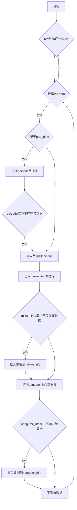

```mermaid
graph TD
A[开始]-->B1{5分钟访问一次rss}
B1-->B2{枚举rss item}
B2--yes-->C1{早于pub_date}
B2--no-->B1
C1--yes-->D1[访问episode数据库]
D1-->C2{episode库中不存在该数据}
C2--yes-->D2[插入数据到episode]
C1--no-->D2
D2-->D4[访问mikan_info数据库]
D4-->C3{mikan_info库中不存在该数据}
C3--yes-->D5[插入数据到mikan_info]
D5-->D6[访问bangumi_info数据库]
C3--no-->D6
D6-->C4{bangumi_info库中不存在该数据}
C4--yes-->D7[插入数据到bangumi_info]
D7-->D8[下载该数据]
C4--no-->D8
D8-->B2
```

