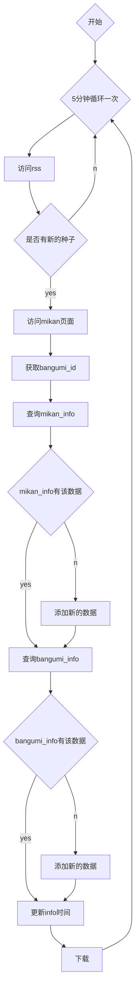

```mermaid
graph TD
A1{开始}-->B1{5分钟循环一次}
B1-->D1[访问rss]
D1-->C1{是否有新的种子}
C1--yes-->D2[访问mikan页面]
C1--no-->B1
D2-->D3[获取bangumi_id]
D3-->D4[查询mikan_info]
D4-->C2{mikan_info有该数据}
C2--yes-->D5[查询bangumi_info]
C2--no-->D6[添加新的数据]
D6-->D5
D5-->C3{bangumi_info有该数据}
C3--no-->D9[添加新的数据]
C3--yes-->D7[更新info时间]
D9-->D7
D7-->D8[下载]
D8-->B1
```

