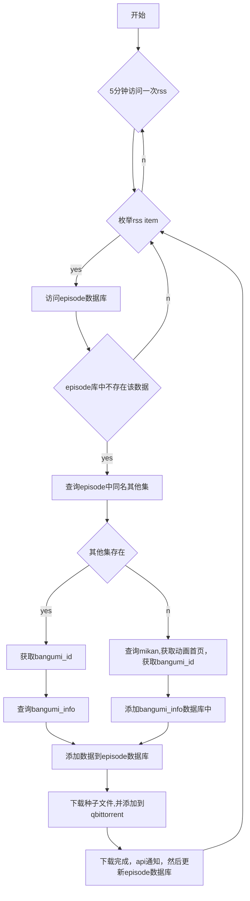

```mermaid
graph TD
A[开始]-->B1{5分钟访问一次rss}
B1-->B2{枚举rss item}
B2--no-->B1
B2--yes-->D1[访问episode数据库]
D1-->C2{episode库中不存在该数据}
C2--no-->B2
C2--yes-->D2[查询episode中同名其他集]
D2-->C3{其他集存在}
C3--yes-->D3[获取bangumi_id]
D3-->D4[查询bangumi_info]
C3--no-->D6[查询mikan,获取动画首页，获取bangumi_id]
D6-->D7[添加bangumi_info数据库中]
D4-->D5
D7-->D5[添加数据到episode数据库]
D5-->D8[下载种子文件,并添加到qbittorrent]
D8-->D9[下载完成，api通知，然后更新episode数据库]
D9-->B2
```

